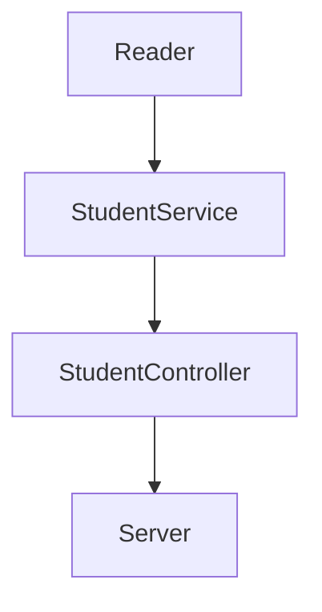
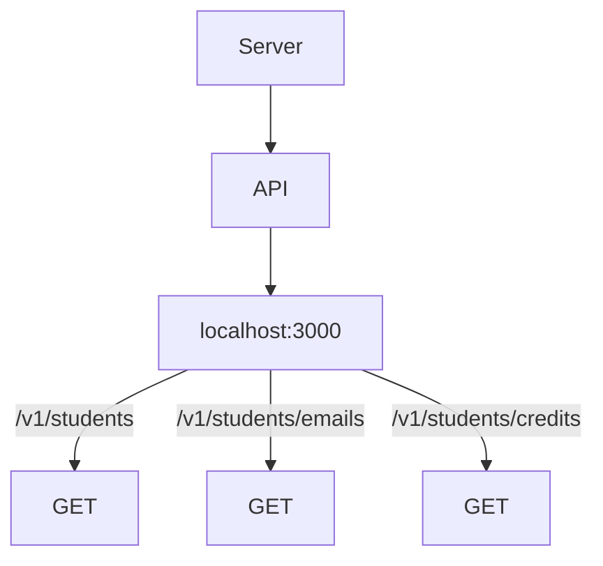
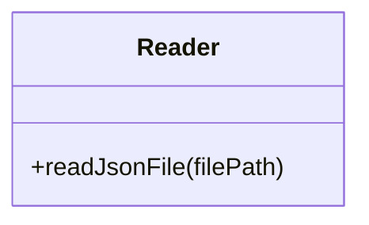
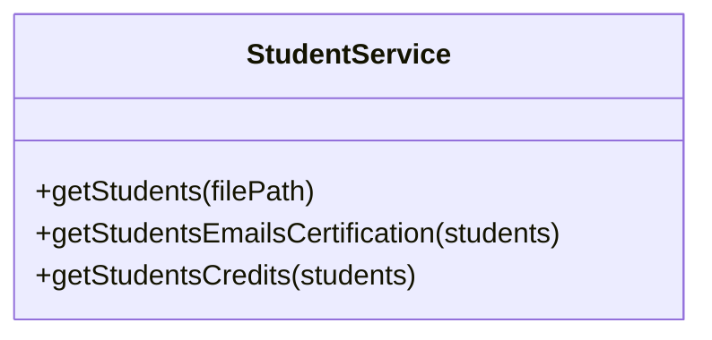
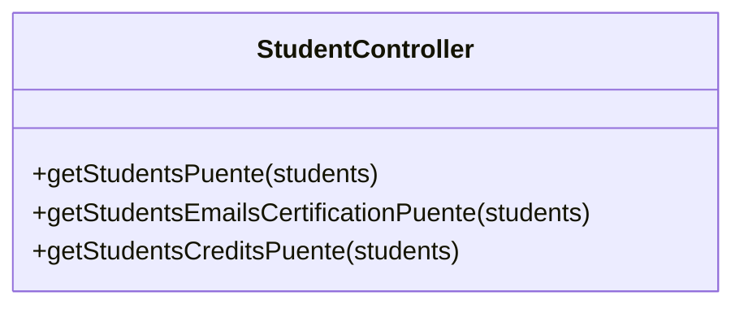

# Code_Challenge: Cursos de Visual Thinking API

Visual Partner-Ship nos ha asignado un nuevo proyecto...😄

## Si te gustaría contribuir o experimentar con el proyecto, sigue estos pasos:👯‍

- Obtén una copia, para ello ejecuta la siguiente línea de código en tu terminal donde te gustaría guardar este proyecto

```
git clone https://github.com/UlisesOrnelasR/code_challenge.git
```

- Descarga todas las dependencias

```
npm install
```

## Las dependencias que estaremos utilizando:📚

1.- **Jest**: Para hacer pruebas de unidas y darle calidad a nuestro código

Usaremos la versión 26 de jest, porque no da problemas a la hora de automatizar las pruebas.
```
npm install jest@26.0.0 --save-dev
```

2.- **ESLint**: Porque nuestro código tendrá estilo, usaremos el de *Airbnb*.

```
npm install eslint --save-dev
```

Ejecutaremos el siguiente código para configurar ESLint, recuerda, escribiremos código al estilo *Airbnb*.

```
npm init @eslint/config

```

Para ejecutar linter y que nos muestre las inconsistencias de nuestro código usaremos `npm run linter` y para corregirlas `npm run linter-fix`.

3.- **Express**: Nos servirá para crear un servidor.

```
npm install express --save
```

#### El package.json ya viene configurado para automatizar las dependencias y poder ejecutarlas con un `npm run server`, modifícalo dependiendo de la ubicación de tus archivos, en mi caso así funciona correctamente:


## ¡Tenemos pruebas automatizadas! Gracias a GitHub Actions🤖✅🦾

Decidimos hacer las pruebas automatizadas para hacer todos los test, y no estar haciendo uno por uno, fue sencillo, te lo explico:

1.- En la raíz de nuestro proyecto creamos una carpeta llamada `.github`, luego dentro de esta, creamos otra carpeta llamada `workflows` y finalmente dentro de esta última un archivo llamado `test.yml`, nuestra estructura para este archivo quedaría así `.github/workflows/test.yml` 

Agregamos el siguiente código al archivo `test.yml`

```
name: Run Tests in my project every push on GitHub

on: [push]

jobs:
  build:
    runs-on: ubuntu-latest
    steps:
    - uses: actions/checkout@v1
    - name: Run Jest
      uses: stefanoeb/jest-action@1.0.3
```

¡Guardamos los cambios, subimos los cambios, hicimos un commit, un push y listo!. Asi es como automatizamos todos nuestros test para cada push que hicieramos.


## Como fue la construcción de la solución del proyecto📝

Se nos pidieron tres cosas:

⚠1.- Habilitar un endpoint para consultar todos los estudiantes con todos sus campos.⚠

⚠2.- Habilitar un endpoint para consultar los emails de todos los estudiantes que tengan certificación haveCertification.⚠

⚠3.- Habilitar un endpoint para consultar todos los estudiantes que tengan credits mayor a 500.⚠

En este diagrama se muestra la estructura del proyecto que se creó:



## Utils🛠

Se tiene que leer la DB proporcionada para eso se creó un archivo Reader.js en la carpeta utils(aqui van las clases auxiliares) donde se creara un método de lectura del archivo. Para esto, usará el método de Node llamado fs.readFileSync() para leer el archivo y devolver su contenido.
Esta clase Redera leerá el archivo que le indiquemos.




## Services⚙

Se creó una clase StudentService en la carpeta services(aqui van las clases para aplicar la lógica que necesitamos) que llevara tres métodos static para obtener lo que necesitamos de los estudiantes.




## Controllers🗜

Se creó una clase StudentController en la carpeta controllers(uso de los services) que servira de puente entre las funcionalidades y el server que se creara.
Esto nos ayudó a tener una mejor estructura, a la vez que una separación de responsabilidades.




## Creación del server con Express 🗃

Se creó un script server.js en la carpeta lib de nuestro proyecto
1.- Creamos un server basico de express 
```
const StudentController = require("./controllers/StudentController");
const express = require("express");
const app = express();
app.use(express.json());
const port = 3000;

app.get("/", (request, response) => {
    response.json({message: "Code_challenge Api welcome!"});
});

app.listen(port, () => {
    console.log(`Code_challenge API in localhost:${port}`);
});
```

Para iniciar el servidor en `http://localhost:3000/`

```
npm run server
```

Para detener el servidor 

```
Ctrl + C 
```

## Agregando 1er endpoint🧾

Despues de realizar todo lo anterior ya solamente restaba agregar los endpoint en `server.js` para finalizar el codigo, esto fue lo necesario para cumplir el primer requisito que era obtener los students con todos sus campos:


Al hacer la consulta en `http://localhost:3000/v1/students` obtenemos:


## Agregando 2do endpoint📑

Se necesitó el siguiente codigo para el segundo endpoint donde obtenemos una lista de emails de los students que tienen cetificacion:


Al hacer la consulta en `http://localhost:3000/v1/students/emails` obtenemos:


## Agregando 3er endpoint📈

En el tercer endpoint necesitabamos obtener los students con creditos mayores a 500, para ello se agrego el siguiente código:


Al hacer la consulta en `http://localhost:3000/v1/students/credits` obtenemos:


## ¡Y asi cumplimos con el proyecto asignado por parte de Visual Partner-Ship!✔
